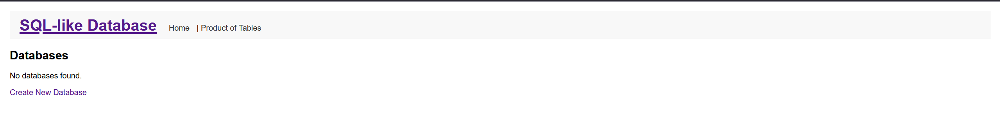
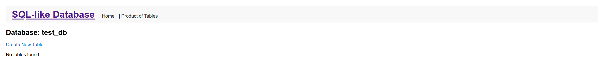
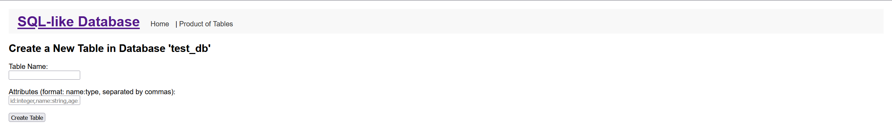
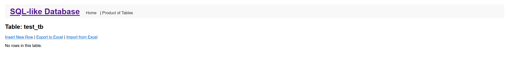
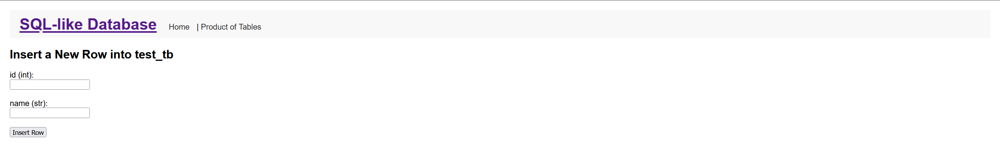
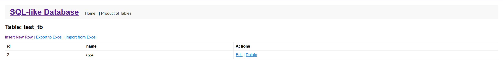

# Звіт
## З лабораторної роботи 1
## З теми “Фрагментарна реалізація системи управління табличними базами даних”

**Виконав:**  
Студент 4 курсу факультету комп’ютерних наук та кібернетики  
Групи МІ-42  
Петрів Георгій Юрійович

### Мета роботи
Метою роботи було розробити фрагментарну систему управління табличними базами даних з використанням SQL-подібного синтаксису. Система повинна забезпечувати збереження та взаємодію з даними через REST API, а також надавати зручний інтерфейс для веб та десктопного використання. Додатково була реалізована підтримка специфічних типів даних, таких як `date` та `dateInterval`, а також методи для взаємодії з таблицями та рядками в базі даних. Для десктопної версії було використано фреймворк Tkinter, а для веб-інтерфейсу — FastAPI.

### Виконані завдання
1. **Розробка класів для бази даних:**
    - **Клас `Attribute`:** Представляє атрибут таблиці з його назвою та типом даних.
    - **Клас `Schema`:** Описує схему таблиці, містить список атрибутів.
    - **Клас `Row`:** Представляє рядок таблиці з даними.
    - **Клас `Table`:** Зберігає назву таблиці, її схему та рядки. Додано методи для вставки, оновлення та видалення рядків.
    - **Клас `Database`:** Управляє таблицями в базі даних, включаючи створення нових таблиць та доступ до існуючих.

2. **Алгоритми взаємодії з даними:**
    - **Створення таблиці:** Перевірка коректності схеми, створення таблиці та додавання її до бази даних.
    - **Вставка рядка:** Валідація даних відповідно до схеми таблиці та додавання нового рядка.
    - **Оновлення рядка:** Внесення змін до існуючого рядка після перевірки даних.
    - **Видалення рядка:** Видалення рядка за індексом з таблиці.

3. **Реалізація REST API:**
    - **Endpoints:**
        - `GET /databases`: Список всіх баз даних.
        - `POST /databases`: Створення нової бази даних.
        - `GET /databases/{db_name}`: Отримання деталей конкретної бази даних.
        - `PUT /databases/{db_name}`: Редагування назви бази даних.
        - `DELETE /databases/{db_name}`: Видалення бази даних.
        - `GET /databases/{db_name}/tables`: Список таблиць в базі даних.
        - `POST /databases/{db_name}/tables`: Створення нової таблиці.
        - `GET /databases/{db_name}/tables/{table_name}`: Отримання деталей таблиці.
        - `PUT /databases/{db_name}/tables/{table_name}`: Редагування таблиці.
        - `DELETE /databases/{db_name}/tables/{table_name}`: Видалення таблиці.
        - `GET /databases/{db_name}/tables/{table_name}/rows`: Список рядків в таблиці.
        - `POST /databases/{db_name}/tables/{table_name}/rows`: Вставка нового рядка.
        - `GET /databases/{db_name}/tables/{table_name}/rows/{row_index}`: Отримання конкретного рядка.
        - `PUT /databases/{db_name}/tables/{table_name}/rows/{row_index}`: Оновлення рядка.
        - `DELETE /databases/{db_name}/tables/{table_name}/rows/{row_index}`: Видалення рядка.
        - `POST /product_tables`: Виконання декартового добутку двох таблиць та збереження результату в іншу базу даних.
        - `GET /databases/{db_name}/tables/{table_name}/export`: Експорт таблиці до Excel файлу.

4. **Інтерфейс користувача:**
    - **Веб-версія:** Розроблено з використанням FastAPI та Jinja2 шаблонів. Інтерфейс включає форми для створення та редагування баз даних, таблиць та рядків, а також можливість експорту даних до Excel.
    - **Десктопна версія (Tkinter):** Створено графічний інтерфейс для управління базами даних та таблицями. Інтерфейс дозволяє створювати, редагувати та видаляти бази даних та таблиці, а також виконувати операції над рядками.

5. **Зберігання даних:** Всі дані зберігаються у пам’яті програми. Для стійкості даних можна додатково реалізувати збереження у файл або базу даних.

6. **Тестування:** Розроблено юніт-тести для перевірки основних функцій класів `Database`, `Table`, `Row` та інших компонентів системи.

7. **Використані фреймворки та інструменти:**
    - **FastAPI:** Для реалізації бекенду та REST API.
    - **Tkinter:** Для створення десктопного інтерфейсу користувача.
    - **Jinja2:** Для шаблонізації веб-інтерфейсу.
    - **Pandas:** Для роботи з Excel файлами при експорті та імпорті даних.
    - **Unittest:** Для розробки та виконання юніт-тестів.

### Порівняння десктопної, веб версії і REST API

| **Аспект**                         | **Десктопна версія (Tkinter)**                   | **Веб-версія**                          | **REST API**                             |
|------------------------------------|-------------------------------------------------|-----------------------------------------|------------------------------------------|
| **Використані фреймворки**         | Tkinter для GUI                                  | FastAPI, Jinja2 для бекенду та шаблонів | FastAPI для реалізації API               |
| **Цільова аудиторія**              | Користувачі, які потребують локального доступу   | Будь-які користувачі з браузером        | Розробники та інтегратори додатків       |
| **Інтерфейс**                       | Графічний інтерфейс з кнопками та формами        | Веб-інтерфейс з HTML формами            | API-запити через HTTP                     |
| **Можливості**                      | Створення, редагування баз даних та таблиць       | Створення, редагування баз даних та таблиць, експорт до Excel | CRUD операції над базами даних та таблицями |
| **Мережеві вимоги**                | Offline                                          | Online                                   | Online                                    |
| **Системні вимоги**                 | Потрібен встановлений Python з Tkinter           | Потрібен браузер та сервер з FastAPI     | Будь-який пристрій з можливістю HTTP-запитів |
| **Зберігання даних**                | В пам’яті або локально з файлів                  | В пам’яті або локально з файлів          | В пам’яті або з використанням баз даних   |
| **Швидкість відповіді**             | Висока, оскільки всі операції локальні           | Залежить від серверної обробки та мережі  | Висока, за умови стабільної мережі        |

### Висновки
В рамках лабораторної роботи було розроблено фрагментарну систему управління табличними базами даних, яка підтримує основні операції CRUD через REST API та надає зручні інтерфейси для взаємодії з користувачем як через веб, так і через десктопний додаток. Використання FastAPI дозволило ефективно реалізувати API для взаємодії з даними, а Tkinter забезпечив простий та інтуїтивно зрозумілий графічний інтерфейс для локального використання. Система підтримує різноманітні типи даних, включаючи специфічні типи `date` та `dateInterval`, що розширює її функціональні можливості для роботи з реальними даними. Розроблені юніт-тести забезпечують базовий рівень перевірки коректності роботи системи.

### Весь код доступний для перегляду та адаптації за посиланням:
[Репозиторій](https://github.com/GeorgyPetriv/IT_LAB1)

### Інструкція користувача
**Інструкція надана для веб-версії, десктопна версія аналогічна:**

1. **Створення бази даних:**
    - Перейдіть на головну сторінку додатку.
    - Натисніть кнопку "Create Database".
    - Введіть назву нової бази даних та підтвердіть створення.

2. **Створення таблиці:**
    - Виберіть створену базу даних зі списку.
    - Натисніть кнопку "Create Table".
    - Введіть назву таблиці та визначте її схему у форматі `назва_атрибуту:тип, ...` (наприклад, `id:integer,name:string,age:integer`).
    - Підтвердіть створення таблиці.

3. **Вставка рядка:**
    - Відкрийте потрібну таблицю.
    - Натисніть кнопку "Insert Row".
    - Введіть значення для кожного атрибуту та підтвердіть вставку.

4. **Редагування рядка:**
    - У таблиці знайдіть рядок, який потрібно редагувати.
    - Натисніть кнопку "Edit" поруч із рядком.
    - Внесіть необхідні зміни та підтвердіть оновлення.

5. **Видалення рядка:**
    - У таблиці знайдіть рядок, який потрібно видалити.
    - Натисніть кнопку "Delete" поруч із рядком та підтвердіть видалення.

6. **Експорт таблиці до Excel:**
    - Відкрийте потрібну таблицю.
    - Натисніть кнопку "Export to Excel".
    - Виберіть місце збереження файлу та підтвердіть експорт.

7. **Декартовий добуток таблиць:**
    - На головній сторінці натисніть "Product of Tables".
    - Виберіть дві таблиці для операції добутку та вкажіть назву нової таблиці.
    - Виберіть базу даних, куди буде збережено результат.
    - Підтвердіть виконання операції.

**Примітка:** У десктопній версії всі функціональні можливості веб-версії реалізовані аналогічно через графічний інтерфейс Tkinter.

Приклад інтерфейсу:

(головний інтерфейс програми)

(інтерфейс бази)

(інтерфейс створення таблиці)

(Інтерфейст таблиці)

(Інтерфейс додавання рядка)

(Інтерфейс таблиці)